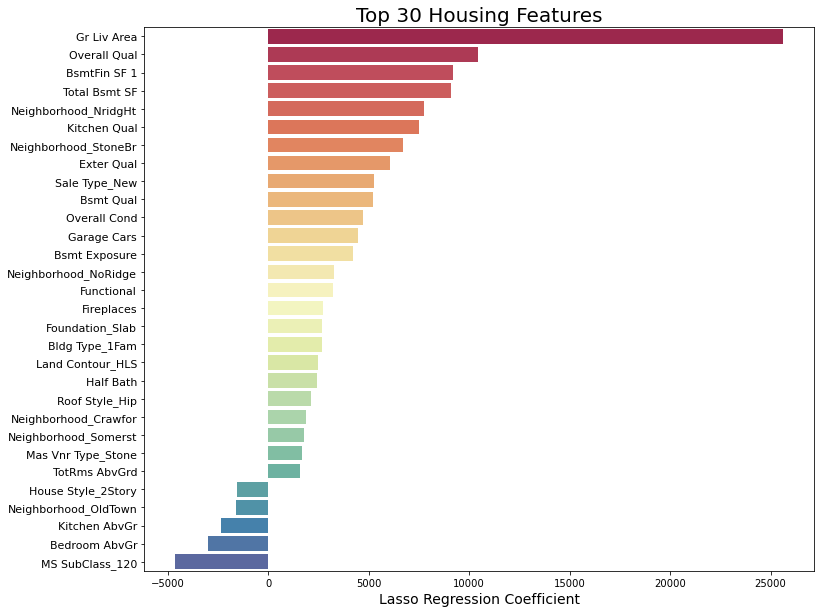

# Project 2: Predicting Housing Prices with Linear Regression

## Introduction & Problem Statement

Determing the sale price of a house is often complicated due to the sheer number of variables that influence pricing decisions. However, with enough data, we can create a linear regression model that can help in determining the most important features of a home and accurately predict housing prices.

With this in mind, the particular problem I'm tackling is: <b>how can we use a linear regression model to best predict house sale prices?</b>

This information can then be used to help property owners maximize the value of their home and increase the sale price of their property on the market.

Using a housing dataset from Ames, Iowa, I've attempted to create a linear regression model that predicts housing sale prices, based on over 2000 housing observations and more than 80 features e.g. square footage and kitchen quality using various feature engineering, selection and regularization techniques.

In this project, I had two goals -- to create both a high performing and extremely generalizable model. This means the model should be react to unseen sets of data without large variations in accuracy. Ultimately, I'll be looking to evaluate the performance of this model using root mean squared error (RMSE) or the measure of the differences between values predicted by the model and the values observed.

## Summary & Recommendations
Based on the scores returned from Kaggle, <b>the Lasso regression model was most successful in predicting sale prices</b>. On the dataset comprising of 30% of the test data, the model achieved an RMSE of 26658. On the dataset comprising of the other 70% of the test data, the model performed within expectations, returning an RMSE of 29400. This is a strong improvement over the baseline RMSE (~80,000) generated by using the mean of all sale prices as predictions.

Earlier versions of the model without systematic feature engineering saw up to a difference of 9,000 in terms of RMSE when given the two different test datasets. Overall, the model seems to have become much more generalizable and consistent. It also has a high R2 on our training data, where it can explain up to 91.5% of the variance in sale price.

Our top features are living area and overall quality, followed by various features such as basement square footage and exterior and kitchen quality. Home functionality and the number of cars that a garage can fit are also important in predicting sale price. We see that location is also important, with certain neighborhoods like Northridge Hieghts and Stone Brook acting strong positive predictors for sale price.

Houses that are in `MS SubClass_120` (1 story houses built in 1946 and after, as part of a planned unit development) predict lower prices. The Old Town neighborhood also predicts lower prices, along with certain features such as the number of kitchens or bedrooms above ground. Having two stories also hurts the value of the home.

## Recommendations
Based on our model, a person looking to increase the value of their house could do the following:
- Try to increase the overall and exterior quality of their home through renovation.
- Switch to a cement or brick exterior if if using a hardboard exterior.
- Improve garage size to allow it to fit more than one car.
- Focus on creating a single indoor kitchen (if there are multiple kitchens).
- Reduce the number of bedrooms in the house, or renovate existing bedrooms to make them multi-purpose rooms (if the house has more than three bedrooms).

While this model generalizes well to the city of Ames, it's probably not generalizable to other cities, given that each city tends to differ greatly in terms of external factors like geographical features, seasonal weather or the economic climate of that particular city.

Another point to keep in mind that <b>this model doesn't take into account the inflation of housing prices</b>. Since the end of the financial crisis in 2008, housing prices throughout the US have been increasing steadily year over year. Our model would need significant retraining to predict the current house prices in Ames today.

## Data Dictionary
A detailed data dictionary can be found [here](http://jse.amstat.org/v19n3/decock/DataDocumentation.txt).